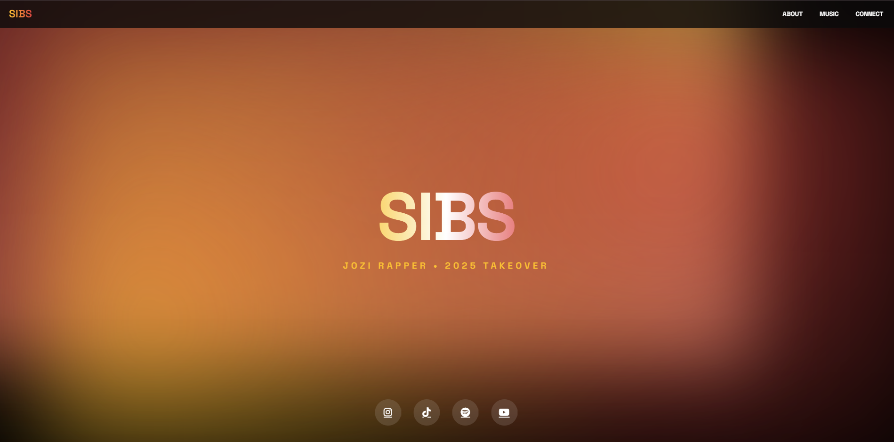

# SIBS Music Website



Please click here to [view live demo](https://music-website-for-an-artist-called.vercel.app/)

---

## Overview

The **SIBS Music Website** is the official promotional website for **SIBS**, a Johannesburg-based rapper. The site is designed to showcase SIBS’ music, brand identity, biography, and booking information in a clean, modern, and visually engaging format.

This project focuses on strong UI/UX design, responsive layouts, and modern visual effects, making it ideal as a portfolio project or a real-world artist website foundation.

---

## Table of Contents

* [Features](#features)
* [Project Structure](#project-structure)
* [Technology](#technology)
* [Installation](#installation)
* [Credits](#credits)
* [License](#license)

---

## Features

* Hero section with animated police light effects
* South African flag–inspired gradient artist name
* About section highlighting the artist’s journey
* Music section with embedded Spotify tracks
* Connect section for bookings and social media links
* Responsive design for desktop, tablet, and mobile
* Glassmorphism UI with smooth hover animations

---

## Project Structure

```
SIBS-Music-Website/
│
├── index.html        # Main landing page
├── css/
│   └── style.css     # Main stylesheet
├── js/
│   └── script.js     # Animations and interactions
├── images/           # Images and visual assets
├── screenshot.png    # Project preview image
└── README.md         # Project documentation
```

---

## Technology

* HTML5 – Semantic structure
* CSS3 – Custom styling, animations, and effects
* JavaScript – Interactive elements
* Responsive design principles

---

## Installation

1. Clone the repository:

   ```bash
   git clone https://github.com/yourusername/Music-Website-For-an-Artist-Called-Sibs-.git
   ```
2. Open the project folder
3. Run `index.html` in your browser

No additional setup is required.

---

## Credits

This project was created for promotional, learning, and portfolio purposes.

Music content and branding belong to the artist **SIBS**.

---

## License

This project is open-source and available under the MIT License.
